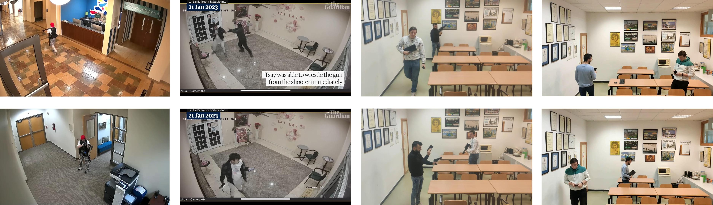

# Best practices for improving real-time weapon detection systems in production environments

## Abstract
Gun violence is a global problem that affects communities and individuals, posing challenges to safety and well-being. The use of autonomous weapon detection systems could significantly improve security worldwide. Despite notable progress in the field of weapon detection CCTV-based systems, several challenges persist, including real-time detection, improved accuracy in detecting small objects, and reducing false positives. This paper, based on our extensive experience in this field and successful private company contracts, presents a detection scheme comprising two modules that enhance the performance of a renowned detector. These modules not only augment the detector's performance but also have a low negative impact on the inference time. Additionally, a scale-matching technique is utilised to enhance the detection of weapons with a small aspect ratio. The experimental results reveal that the scale-matching method improves small object detection (+13.23 AP50). Our suggested detection scheme effectively reduces the number of false positives (70\%) of the base model while preserving a low inference time (34 FPS on an NVIDIA GeForce RTX-3060 card with a 720p resolution) compared to the baseline (47 FPS).

## Dataset
This study presents a new dataset called 'Disarm-Dataset'. In this page, only the test set is available.

### Disarm-Dataset (test set)
This dataset has been manually annotated and collected using four different videos. Two of the videos were recorded via a CCTV and represent real case scenarios, these were manually annotated at a rate of 2 frames per second (FPS), resulting in 256 images per video. The third one was captured in a room replicating a CCTV camera environment featuring guns and objects resembling weapons; this video underwent manual annotation at a rate of 30 frames per second, resulting in 3305 images. The final footage, also recorded at 30 frames per second, was filmed in the same setting, but excluded any depictions of weaponry, generating 2019 images.

You can download the dataset [here](https://uses0-my.sharepoint.com/:u:/g/personal/atorregrosa_us_es/EbaqVeZcnRJBkeaE4hABRk0BwGEOnOfLaSb1Htsv-sEkig?e=w45Ngu){:target="_blank" rel="noopener"}.

  

## Terms of use
This subset can be used for academic research free of charge, citing the paper as we explain below. If you seek to use the data for commercial purposes please or gain access to the full dataset [contact us](mailto:jaalvarez@us.es).

## Citation
If you use our dataset, please kindly cite the following paper: coming soon.

This work is licensed under a
[Creative Commons Attribution-NonCommercial 4.0 International License][cc-by-nc]. Contact the authors of this work for commercial use. 

[![CC BY NC 4.0][cc-by-nc-image]][cc-by-nc]

[cc-by-nc]: http://creativecommons.org/licenses/by-nc/4.0/
[cc-by-nc-image]: https://i.creativecommons.org/l/by-nc/4.0/88x31.png
